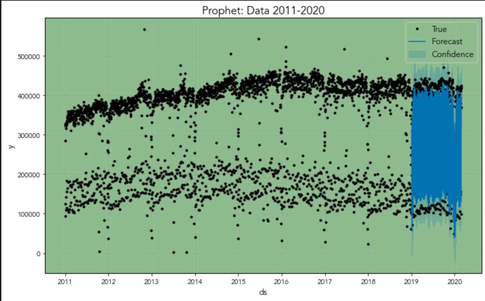
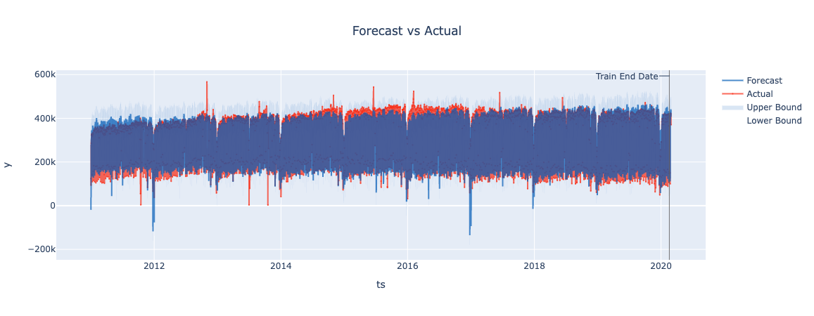
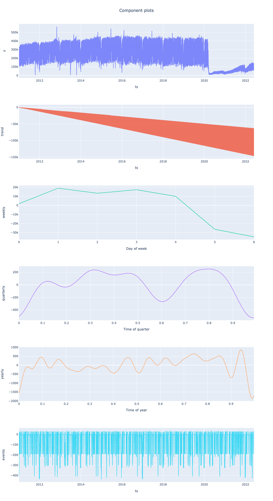

# Model Transit Ridership as Fuel Prices Fluctuate

---
SUMMARY
---
I modelled ridership in general, and with a few additional regressors. Various models using [Facebook's _Prophet_](https://facebook.github.io/prophet/) and [Linkedin's _Greykite_](https://linkedin.github.io/greykite/) frameworks produced good results for modelling data prior to early-COVID-pandemic-shutdowns, but they and _ARIMA_ models failed to capture the percipitous, unprescendented monthly riderhip drop, and exceedingly low rise. 

I included average _fuel price_, increased number of _registered cars_ as well as _consumer debt_ as additional regressors in both _Prophet_ and _Greykite_, but there was no significant effect at that resolution. 

Sourcing local data - at the ZIP-code or even county level, would likely yield better results. 

=== 
CURRENTLY WORKING ON HOURLY DATA. 

The also unprecedented fuel prices further exemplify one of the main challenges in time-series modeling, which has prompted a very simple plot of at-the-pump-price-rate-of-change compared to petroleum-barrel-price-change-rate compared to wheat and bread. 

A little bit of Econ. 

--- 
## DATA
---

Data was sourced via various sources, through API requests and extracting from spreadsheets obtained directly from state sources. Details can be found in the [data acquisition notebooks](/code/01_API_pulls.ipynb)

---

## _Exploratory Data Analyses_ 

I've set up interactive visualizations using [Plotly](https://plotly.com) on my [website](https://blog.giovannaguevara.net/?page_id=961). Ridership numbers had a downward decline starting in late 2018, so initial forecasts predicted lower ridership in 2020 even prior to the pandemic. 

Summary statistics for daily, weekly, monthy and annual ridership shown below.

 

### MODELS: 
Model performance visualized below

_ARIMA model over gridsearch yielded (4,1,4) model._

_Greykite model with extra regressors performed best on data prior to COVID_

_PROPHET model poorly predicted downward trend even prior to COVID decrease_

_PROPHET_ framework forecast within confidence

_Greykite_ framework forecast pre-pandemic

_Greykite_ framework components for all data

ID      | MODEL   | DATA      | RMSE        | MSE       | MAE               | MAPE           | AIC 
---     | ---     | ---        | ---       | ---       | ---             | ---             | ---  
A       | PROPHET | < 2020   | 446 152   | 199 052 198 567| 375 686             
B       | PROPHET | All BART   | 1 243 269   | 5 457 200 928 927| 1 181 450             
C       | Greykite| All BART    | 911 443 | 830 729 769 011   |909 234  | 205 | 4 621
D       | Greykite| < 2020    | 1 053 866| 110 633 739 830  |1 051 141|  5.25 | 4 581
D |     ARIMA   | < 2020  | 208 415 |  43 437 169 639| 89 738 | |   5880

--- 
## Conclusion: 
Although _Prophet_ and _Greykite_ are extremely powerful and flexible, tried-and-true _ARIMA_ produced the best model for forecasting rideship, both for data inclusive of COVID shutdowns and without. As a true time-series model, the changes were better captured. _Prophet_ and _Greykite_ are built as standard linear regerssors parameters and coefficients to model holidays, seasons, weekends, etc. - the limitations of monthly data also negate the power and flexibility of frameworks designed to model just that. 
> <b>Further Work:</b> I am sourcing daily data from BART, so auto-regression on daily, weekly, monthly and yearly basis should be straightforward. However, limitation for in-depth exogenous anaylis is still granularity of such datasets. I am also working on mapping short vs long-distances (commute) trips to assess if there are differences in COVID-realted ridership for intra- vs inter- city trips. 